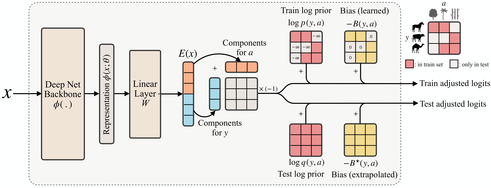

# Compositional Risk Minimization (CRM)


<p align="center">
  
</p>

This repository contains the code associated with the paper:  **[Compositional Risk Minimization](https://arxiv.org/abs/2410.06303)**  
Authors: Divyat Mahajan, Mohammad Pezeshki, Charles Arnal, Ioannis Mitliagkas, Kartik Ahuja†, Pascal Vincent†  
Accepted at **ICML 2025**. [OpenReview](https://openreview.net/forum?id=axN83wi3NH)

## Abstract

Compositional generalization is a crucial step towards developing data-efficient intelligent machines that generalize in human-like ways. In this work, we tackle a challenging form of distribution shift, termed compositional shift, where some attribute combinations are completely absent at training but present in the test distribution. This shift tests the model's ability to generalize compositionally to novel attribute combinations in discriminative tasks. We model the data with flexible additive energy distributions, where each energy term represents an attribute, and derive a simple alternative to empirical risk minimization termed compositional risk minimization (CRM). We first train an additive energy classifier to predict the multiple attributes and then adjust this classifier to tackle compositional shifts. We provide an extensive theoretical analysis of CRM, where we show that our proposal extrapolates to special affine hulls of seen attribute combinations. Empirical evaluations on benchmark datasets confirms the improved robustness of CRM compared to other methods from the literature designed to tackle various forms of subpopulation shifts.

## Table of Contents

- [Requirements](#requirements)
- [Download and Pre-process Data](#download-and-pre-process-data)
- [Experiments](#experiments)
  - [Quick Run](#quick-run)
  - [Hyperparameter Tuning Results](#hyperparameter-tuning-results)
  - [Analyzing Results](#analyzing-results)
  - [Group Complexity Experiments](#group-complexity-experiments)
- [License](#license)

## Requirements

To set up the environment, clone this repository and install the required packages:

```bash
conda your_env create -f environment.yml
```

## Download and Pre-process Data

```bash
python -m src.scripts.download --datasets waterbirds celeba civilcomments multinli metashift nicopp --data_path ./datasets --download  --gen_meta_data --precompute_feat
```

Note that ```--precompute_feat``` flag does a forward pass for one epoch to store the feateures from the pretrained backbone for each dataset. This is useful for linear probing (no finetuning) experiments as we can directly load these precomputed features instead of computing them during the training/inference loop. For larger datasets (CivilComments, MultiNLI) this step might take a while to complete, so the user can skip the ```--precompute_feat``` flag if they do not intend to do linear probing experiments.

## Experiments

We illustrate the commands for CRM on the Waterbirds dataset, where we discard the group 0 during training. For launching the complete list of experiments, check the [launcher.py](src/scripts/launcher.py) file.

```bash
DATASETS="Waterbirds"
ALGOS="CRM"
```

### Quick Run

For a fast linear probing experiment with fixed hyperparameters, run the following command.
 
```bash
python -m src.main --case train --datasets $DATASETS  --algorithms $ALGOS --data_path ./datasets --out_dir ./out --add_discarded_group 0 --quick_run --precompute_features --seed 1 
```

 The ```--quick_run``` flag uses the hyperparameters defined in the [launcher.py](src/utils/hparams_registry.py) file, which can be changed by the user. Also, removing the ```--precompute_features``` flag allows for full finetuning experiments. 

### Hyperparameter Tuning Results

#### 5 hyperparameter combinations x 1 seed

For each (method, dataset), we obtain results for 5 different  hyperparameter combinations with a fixed seed. 

```bash
python -m src.main --case train --datasets $DATASETS  --algorithms $ALGOS --data_path ./datasets --out_dir ./out --add_discarded_group 0 --num_hparams_combs 5 --num_seeds 1 
```

#### Selected hyperparameter combination x 3 seeds

For each (method, dataset), we use the group balanced accuracy on the validation set to obtain the best hyperparamater combination. The best hyperparameter combinations are then run fo 3 random seeds.
```bash
python -m src.main --case train  --datasets $DATASETS  --algorithms $ALGOS --data_path ./datasets --out_dir ./out  --add_discarded_group 0 --best_hparams_comb_selection_metric va_unf_acc --num_seeds 3
```

### Analyzing Results

To read the results from the log files, run the following command.

```bash
python -m src.scripts.analyze_results --dataset $DATASETS --algorithms $ALGOS --dir ./out --selection_criterion unf_acc
```

### Group Complexity Experiments

To reproduce results for the CRM's analysis with varying group size (Section G.6), use the following command to generate data for the specific ($m$, $d$) configuration

```bash
python -m src.data.multivariate_gaussian --total_attr m --total_cat d
```

The launch the following command to train model with $x$ percentage of groups dropped
```bash
python -m src.main --case train --datasets SynAED_{m}_{d}  --precompute_feat --quick_run --algorithms CRM --data_path ./datasets --out_dir ./out --add_discarded_group {(x-1)/10}  --num_seeds 1 
```


## License

This source code is released under the CC-BY-NC license, included [here](LICENSE).
